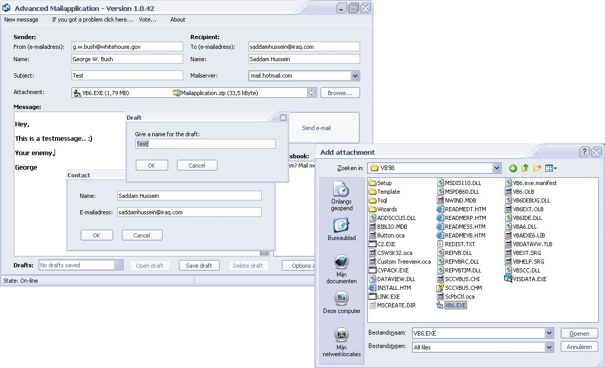



## Advanced Mailapplication \- UPDATED/FIXED \- \(24\-07\-2003\)

### Description

It's really simple to send e-mails. You can use anyone's e-mailadress, add attachments, adressbook, save drafts...

If you've any suggestions/bugs to improve this program, send me a comment.

The author is not responsible for any damage that may occure while using the program. If you do not agree to this term then please do not use the program.

For example: If you send a message from George W. Bush (g.w.bush@whitehouse.gov) to Saddam Hussein (sadamhussein@iraq.com) ->>> I'm not responsible for this!!!
 
### More Info
 

             |
---                |---
**Submitted On**   |2003-07-04 18:06:02
**By**             |[Henrico Bloemhof](https://github.com/Planet-Source-Code/PSCIndex/blob/master/ByAuthor/henrico-bloemhof.md)
**Level**          |Advanced
**User Rating**    |4.7 (225 globes from 48 users)
**Compatibility**  |VB 6\.0
**Category**       |[Complete Applications](https://github.com/Planet-Source-Code/PSCIndex/blob/master/ByCategory/complete-applications__1-27.md)
**World**          |[Visual Basic](https://github.com/Planet-Source-Code/PSCIndex/blob/master/ByWorld/visual-basic.md)
**Archive File**   |[Advanced\_M1619597242003\.zip](https://github.com/Planet-Source-Code/henrico-bloemhof-advanced-mailapplication-updated-fixed-24-07-2003__1-46547/archive/master.zip)

